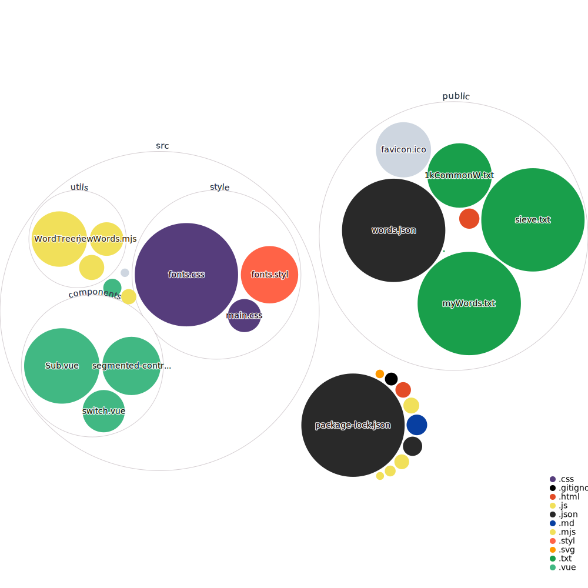

Learn the vocabulary/sentences in English materials before watching/reading them.

You can enter English material, such as English subtitles or an article, and the program will output all the words in a list that will be divided into two categories: words you already know and words you need to learn.

After you log in, you may mark the words you already know by clicking on the checkboxes, or click again to delete the words you don't know. You can find all the words you have marked as acquainted in the *Mine* section.

## Quick Features

- Merge plural nouns and irregular verbs to stem words
- 100k words mering and analysis took less than 0.2s (on average PC or Mac)
- Login to mark or batch import your own vocabulary

### overview

## Stack

In addition to Vue 3 and Vite, the project's stack includes:

- [Tailwind CSS](https://tailwindcss.com)
- [TypeScript](https://typescriptlang.org)
- [Element Plus](https://element-plus.org)
- [Pinia](https://pinia.vuejs.org)
- [VueUse](https://vueuse.org)
- [Vue Router](https://router.vuejs.org)
- [Vue I18n](https://kazupon.github.io/vue-i18n)
- [TanStack Query](https://tanstack.com/query/v4/docs/adapters/vue-query)
- [Axios](https://axios-http.com)

## Visualization

<a href="https://mango-dune-07a8b7110.1.azurestaticapps.net/?repo=kyle1an%2FSubVocab">Visualization of this repo</a>

